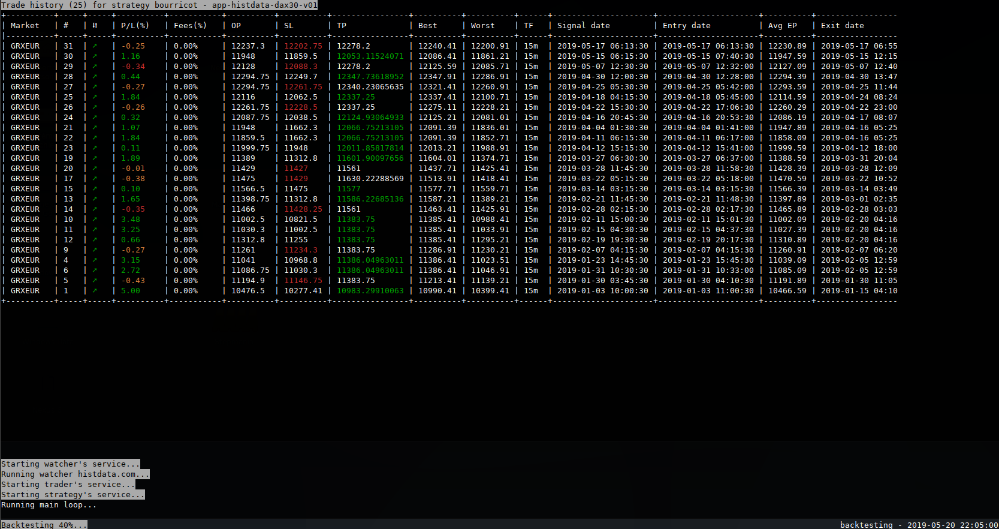
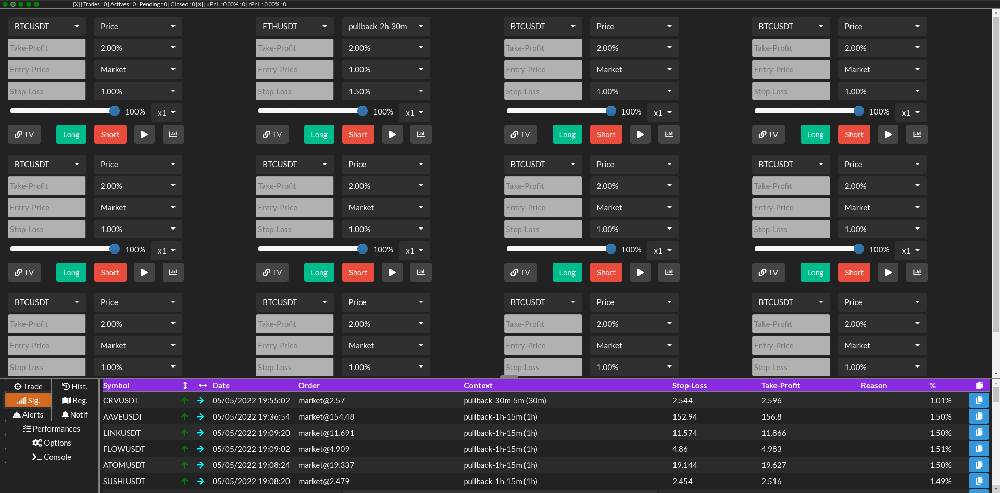

SiiS Self Investor Income System
================================

Copyright (c) 2018-2022 Frédéric Scherma. All rights reserved.

Abstract
--------

SiiS is a trading bot for forex, indices and cryptocurrencies markets.
It also supports semi-automated trading in way to manage your entries and exits
with more possibilities than exchanges allows.

It is developed in Python3, using TA-lib, numpy and twisted/autobahn.
Uses a PostgreSQL database. Can support MySQL (not officially tested).

I have no commercials interests with trading platforms.

Terminal Trader presentation
----------------------------


Web Trader presentation
-----------------------


Features
--------

* Intended for Linux, but should work on Windows (c) or MacOSX (c)
* Traditional and crypto-markets trading platforms are supported
    * [x] Binance Spot (no margin)
    * [x] Binance Future
    * [x] Bitmex
    * [x] IG CFD (forex, indices, commodities)
    * [x] Kraken Spot
    * [x] Kraken Margin (partial)
    * [ ] Kraken Futures (planned)
* Some others source of prices/volumes data fetchers
    * [x] HistData (only to import manually downloaded files)
    * [ ] AlphaVantage (planned)
* Fetching of OHLC history data in SQL database
* Fetching of ticks or trades history data optimized files
* Multiple instances can be executed at the same time
  * One strategy configured per instance
  * One exchange (account) configured per instance
  * Works with 100+ simultaneous markets
* Connection with API key
  * You can check than yours API keys are safe with SiiS by reviewing the source code
* Configuration of multiple accounts identities
* Configuration of multiple profiles of strategies
  * Customize an existing strategy
  * Customize per markets parameters
  * Some parameters can be modified during runtime (depending on the strategy)
* Backtesting support : Replay of history for one or many markets
  * Analyse reports
  * Replay-mode with a configurable slow-down factor
    * You can manually trade during a replay
* Paper-mode : simulate an exchange using live market data
  * Works with spot market, margin and positions
* Live-mode : real trading on your broker account
* Interactive command line interface
  * Many views available using shortcuts
  * Desktop notification on Linux (notify2 lib)
  * Audio alerts on Linux (alsa aplay)
* Web application interface
  * Most of the trading features are available
  * Notification
  * Audio alerts
* Support the spread, fees and commissions on the profit/loss display
* Possibility to compute the average entry price of owned assets for spots markets
  * [x] Binance Spot
  * [ ] Kraken Spot (WIP)
* Web trader and terminal screen, display :
  * account details and assets quantities
  * tickers and markets information, 24h change and volume
  * active and pending trades
  * trades performance (historical and actives)
  * alerts, signals, regions
  * ...
* Works on multiple timeframes from 1 second to 1 month
    * Can compute at each tick/trade or at any timeframe
* Support for order-flow (WIP)
* Common indicators are supported :
    * Momentum, RSI, Stochastic, Stochastic RSI
    * SMA, EMA, HMA, WMA, VWMA, MAMA
    * MACD
    * Bollinger Bands
    * Donchian Channels
    * ATR, ATR based Supports Resistances
    * SAR
    * Ichimoku
    * SineWave
    * Pivot Point Supports/Resistances
    * TomDemark TD9
    * ...
* Full automated trading or semi-automated trading
  * Notify and display signals to manually validate
* External notifiers for signals, trading and status :
    * [x] Desktop Linux (popup through D-Bus, audible alerts using aplay)
    * [x] Discord using WebHook (signal, trade, trade list, performance)
    * [x] Telegram (with bot commands)
    * [x] Android application (signal, trade, account) with an external project
    * [ ] XMPP (planned)
* 4 initials strategies serves as examples :
    * BitcoinAlpha for serious coins
    * CryptoAlpha for alt coins
    * ForexAlpha for forex pairs
    * CrystalBall signal (no trading)
    * Ability to implements your own strategies or to pay for a development
* WebHook on TradingView strategies (not maintained) 
  * Uses TamperMonkey with Javascript
  * Watch the strategy trade last
* Manually add per trade directives
    * One or many stop-loss operation (trigger level + new stop price)
* Manually add per market some regions of interest to help the bot filtering signals
    * Define a region for trade entry | exit | both in long | short | both direction
    * Strategy can filter signal to only be processed in your regions of interest
    * Two types of regions :
        * [x] Range region : parallels horizontals, low and high prices
        * [x] Trend channel region : slanting, symmetric or asymmetric low and high trends
    * Auto-expiration after a predefined delay
    * Cancellation above a trigger price

### Donate and support ###

Feel free to donate for my work :

* BTC: 1GVdwcVrvvbqBgzNMii6tGNhTYnGvsJZFE
* ETH: 0xd9cbda09703cdd4df9aeabf63f23be8da19ca9bf
* XLM: GA5XIGA5C7QTPTWXQHY6MCJRMTRZDOSHR6EFIBNDQTCQHG262N4GGKTM / memo: 3296292669
* DOGE: D5oxDR7u1ssEwkGY444ewUJVHWzsHpCkoA

Installation
------------

Need Python 3.8 or a more recent version. Tested on Debian, Ubuntu and Fedora.

First you have to fetch this repository or to download a recent release. 

### Create the PIP virtual env ###

From siis base directory :

```
python3 -m venv .venv
source .venv/bin/activate
```

You need to activate it each time you open your terminal before running SiiS.

From deps/ directory, first install TA-Lib (a C lib needed by the Python binding) :

```
tar xvzf deps/ta-lib-0.4.0-src.tar.gz
cd ta-lib
cp ../deps/patch/ta_utility.h src/ta_func
./configure
make
```

This includes a patch necessary to get correct Bollinger-Bands values for market price very low (<0.0001) else all the values will be the sames.

Eventually you need to have to install the build-essential packages from your distribution repository in way to have GCC, Make and Autotools.
On Debian you can do : _apt-get install build-essential_.

Finally, to install in your /usr/local :

```
sudo make install
```

Or eventually if you have installed TA-lib in a custom prefix (e.g., with ./configure --prefix=$PREFIX),
then you have to specify 2 variables before installing the requirements :

```
export TA_LIBRARY_PATH=$PREFIX/lib
export TA_INCLUDE_PATH=$PREFIX/include
```

For more details on TA-lib installation please visit : https://github.com/mrjbq7/ta-lib

### Python dependencies ###

From siis base directory :

```
pip install -r deps/requirements.txt
```

Then depending on which database storage to use :

```
pip install -r deps/reqspgsql.txt  # if using PostgreSQL (recommended)
pip install -r deps/reqsmysql.txt  # or if using MySQL
```

You might need to install the C client library before. Please refer to psycopg2 or MySQLdb Python package documentation.
On Debian based for PostgreSQL you will need to install libpq-dev by doing : _apt-get install libpq-dev_.

Before running the lib folder containing TA-Lib must be found in the _LD_LIBRARY_PATH_ :

Doing, if installed in the default directory _/usr/local/lib_ :

```
export LD_LIBRARY_PATH=/usr/local/lib:$LD_LIBRARY_PATH
```

### Database ###

Prefers the PostgreSQL database server for performance and because I have mostly tested with it.
Another argument in favor of PostreSQL is in a future I could use of the extension TimescaleDB to improve timeseries tables performances.

The sql/ directory contains the initial SQL script for creations of the tables.
The first line of comment in these files describe a possible way to install them.

#### PostgreSQL ####

##### TimescaleDB #####

The following step is not required at this time.

###### Debian or Ubuntu ######

In root (or sudo) :

```
sh -c "echo 'deb https://packagecloud.io/timescale/timescaledb/debian/ `lsb_release -c -s` main' > /etc/apt/sources.list.d/timescaledb.list"
wget --quiet -O - https://packagecloud.io/timescale/timescaledb/gpgkey | sudo apt-key add -
sudo apt-get update
sudo apt-get install timescaledb-postgresql-11
```

You could have to replace `lsb_release -c -s` by buster ou bulleye if you are on a Debian sid.

##### Database creation #####

```
su - postgres
```

If you are using TCP socket connection do :

```
psql -h localhost -U root -W -p 5432
```

If you are using a local unix socket :

```
psql -U root -W
```

Then in the psql CLI (you can define another username or password) :

```
CREATE DATABASE siis;
CREATE USER siis WITH ENCRYPTED PASSWORD 'siis';
GRANT ALL PRIVILEGES ON DATABASE siis TO siis;
```

For the future usage of TimescaleDB (this step is not required for now)

```
CREATE EXTENSION timescaledb;
```

Now exit (CTRL-C) the psql CLI.

You can run the table creation script :

Using TCP socket connection do :

```
psql -h localhost -d siis -U siis -W -p 5432 -a -q -f sql/initpg.sql
```

Or using local unix socket :

```
psql -d siis -U siis -W -a -q -f sql/initpg.sql
```

Configuration
-------------

The first running create a data structure on your local user.
* /home/\<username\>/.siis on Linux based systems
* C:\Users\\<username\>\AppData\Local\siis on Windows
* /Users/\<username\>/.siis on MacOSX

The directory will contain 4 subdirectories:

* config/ contains important configurations files (described belows)
  * [Explanations of the different configuration files](/doc/config.md)
* log/ contains the log files
  * [Explanations of the different log files](/doc/logging.md)
* markets/ contains the market data with subdirectories for each exchange
  * [Explanations of the markets data](/doc/dataset.md)
* reports/ contains the reports of the strategies traders, and used by default for scripts executions results
  * Some strategy have the capacity to log trades, signals, performance and even more.
  * Some user script write files to disk by using this directory as default

Running
-------

```
python siis.py <identity> [--help, --options...]
```

### List of command line options ###

* --help display command line help.
* --version display the version number.
* --profile=\<profile> Use a specific profile of appliance else default loads any.
* --paper-mode instantiate paper mode trader and simulate as good as possible.
* --backtest process a backtesting, uses paper mode traders and data history available in the database.
* --timestep=\<seconds> Timestep in seconds to increment the backesting. More precise is more accurate but need more computing simulation. Adjust to at least fits to the minimal candles size uses in the backtested strategies. Default is 60 seconds.
* --time-factor=\<factor> in backtesting mode only allow the user to change the time factor and permit interacting during the backtesting. Default speed factor is as fast as possible.
* --from=<YYYY-MM-DDThh:mm:ss> define the date time from which start the backtesting, fetcher or binarizer. If omitted use whole data set (take care).
* --to=<YYYY-MM-DDThh:mm:ss> define the date time to which stop the backtesting, fetcher or binarizer. If omitted use now.
* --last=\<number> Fast last number of candles for every watched market (take care can take all requests credits on the broker).
* --market=\<market-id> Specific market identifier to fetch, binarize only.
* --broker=\<broker-name> Specific fetcher or watcher name to fetch or binarize market from.
* --timeframe=\<timeframe> Time frame unit or 0 for trade level. For fetcher, higher candles are generated. Defined value is in second or an alias in **1m, 3m, 5m, 15m, 30m, 1h, 2h, 4h, 1d, 1M, 1w**
* --cascaded=\<max-timeframe> During fetch process generate the candles of highers timeframe from lowers. Default is no. Take care to have entire multiple to fulfill the generated candles.
* --spec=\<specific-option> Specific fetcher option (example STOCK for alphavantage.co fetcher to fetch a stock market).
* --watcher-only Only watch and save market/candles data into the database. No trade and neither paper mode trades are performed.
* --read-only Don't write OHLCs candles data to the database. Default is writing to the database.
* --fetch Process the data fetcher.
* --install-market Used only with --fetch to only install the fake market data info to database without trying to fetch anything.
* --binarize Process from text file to binary a conversion, for a market (text version of data could be removed on the future).
* --rebuild Rebuild OHLC from the trades/ticks data for a market. Need to specify --broker, --market, --timeframe, --from and --to date, --cascaded
* --optimize Check one or many market for trades/ticks or OHLCs, and returns data corruption or gaps (later could propose some fix). Need to specify --broker, --market, --timeframe, --from and --to date
* --sync Synchronize the market data from the broker. Need to specify --broker and --market
* --export Market data export tool, to use with --broker=, --market=, --from=, --to=, --timeframe= and --filename= arguments
* --import Market data import tool from previous export, to use with --filename= argument

You need to define the name of the identity to use. This is related to the name defined into the identity.json file.
Excepted for the tools (fetch, binarize, optimize, rebuild, sync, export, import) the name of the profile to use --profile=\<profilename> must be specified.

There are different running mode, the normal mode, will start the watching, trading capacity (paper-mode, live or backtesting) and offering an interactive terminal session,
or you can run the specifics tools (fetcher, binarizer, optimizer, syncer, rebuilder...).

[More information about the different tools.](doc/tools/)

Fetcher : importing some historical market data
-----------------------------------------------

Fetching is for getting historical market data of OHLC, and also of trade/tick data.
OHLC goes into the SQL database, trades/ticks data goes to binary files, organized into the markets/ directory.

Starting by example will be more easy, so :

```
python siis.py real --fetch --broker=binance.com --market=*USDT,*BTC --from=2017-08-01T00:00:00 --to=2019-08-31T23:59:59 --timeframe=1w
```

This example will fetch any weekly OHLC of pairs based on USDT and BTC, from 2017-08-01 to 2019-08-31.
Common timeframes are formed of number plus a letter (s for second, m for minute, h for hour, d for day, w for week, M for month).
Here we want only the weekly OHLC, then --timeframe=1w.

Defines the range of datetime using --from=\<datetime> and --to=\<datetime>.
The format of the datetime is 4 digits year, 2 digits month, 2 digits day of month, a T separator (meaning time),
2 digits hour, 2 digits minutes, 2 digits seconds. The datetime is interpreted as UTC.

The optional option --cascaded=\<max-timeframe> will generate the higher multiple of OHLC until one of (1m, 5m, 15m, 1h, 4h, 1d, 1w).
The non-multiple timeframe (like 3m, or 45m) are not generated with cascaded because of the nature of the implementation in cascade it's not possible.
You have to use the rebuild command option to generate these OHLC from the direct sub-multiple.

For example, this will fetch from 5m OHLC from the broker, and then generate 15m, 30m, 1h, 2h, 4h and 1d from them :

```
python siis.py real --fetch --broker=binance.com --market=BTCUSDT --from=2017-08-01T00:00:00 --to=2019-08-31T23:59:59 --timeframe=5m --cascaded=1d
```

Market must be the unique market id of the broker, not the common usual name. The comma act as a separator. Wildcard * can be placed at the beginning of
the market identifier. Negation ! can be placed at the beginning of the market identifier to avoid a specific market when a wildcard filter is also used.
Example of --market=\*USDT,!BCHUSDT will fetch for any USDT based excepted for BCHUSDT

If you need to only fetch the last n recent OHLCs, you can use the --last=\<number> option.

The --spec optional option could be necessary for some fetchers, like with alphavantage.co where you have to specify the type of the market (--spec=STOCK).

Getting trade/tick level imply to define --timeframe=t. 

```
python siis.py real --fetch --broker=binance.com --market=BTCUSDT --from=2017-08-01T00:00:00 --to=2019-08-31T23:59:59 --timeframe=t
```

You can set the --cascaded option even from tick/trade timeframe.
For example a complete fetching from 1m to 1w :

```
python siis.py real --fetch --broker=binance.com --market=BTCUSDT --from=2017-08-01T00:00:00 --to=2019-08-31T23:59:59 --timeframe=t --cascaded=1w
```

In the scripts/ directory there is some examples of how you can fetch your data using a bash script. Even these scripts could be added in a crontab entry.

Take care than some brokers have limitations. For example IG will limit to 10000 candles per week. This limit is easy to reach.
Some other like BitMex limit to 30 queries per second in non auth mode or 60 in auth mode.
Concretely thats mean get months of data of trades could take more than a day.

[More information about the fetching process and the different fetchers.](doc/fetching.md)

Backtesting
-----------

Lets start with an example :

```
python siis.py real --profile=my-backtest1 --backtest --from=2017-08-01T00:00:00 --to=2017-12-31T23:59:59 --timestep=15
```

Backtesting, like live and paper-mode need to know which profile to use. Let's define a profile file named my-backtest1.json in .siis/config/profiles/,
and an appliance file that must be referred from the profile file.

The datetime range must be defined, --from and --to, and a timestep must be specified.
This will be the minimal increment of time - in second - between two iterations.
The lesser the timestep is the longer the computation will take, but if you have a strategy that work at the tick/trade level then the backtesting
will be more accurate.

The C++ version (WIP) have no performance issue (can run 1000x to 10000x faster than the Python version).

Imagine your strategy works on close of 4h OHLC, you can run your backtesting with a --timestep=4h. Or imagine your strategy works on close of 5m, 
but you want the exit of a trade be more reactive than 5m, because if the price move briefly in few seconds, then you'll probably have different results
using a lesser timestep.

Ideally a timestep of 0.1 will give accurate results, but the computations will take many hours. Some optimizations to only recompute the only last value
for indicators will probably give a bit a performance, but the main problem rest the nature of the Python, without C/C++ submodules I have no idea
how to optimize it : GIL is slow, Python list and slicing are slow, even a simple loop take a lot of time compared to C/C++.

Originally I've developed this backtesting feature to be focused to replay multiples markets, on a virtual account, not only oriented to backtest the raw
performance of the strategy.

Adding the --time-factor=\<factor> will add a supplementary delay during the backtesting. The idea is if you want to replay a recent period,
and have the time to interact manually, like replaying a semi-automated day of scalping. The factor is a multiple of the time : 1 meaning real-time,
and then 60 mean 1 minute of simulation per second.

[More information about the backtesting processing and advanced usages.](doc/backtesting.md)

How to create or modify a strategy
----------------------------------

[A guide explaining how to create, modify and configure a strategy.](doc/strategy.md)

The winning strategy
--------------------

Understand the given strategies acts here as examples, you can use them, can work on some patterns, cannot work
on some others. Considers doing your owns, or to use SiiS as a trading monitor with improved trade following,
dynamic stop-loss, take-profit. Some fixes could be needed for the current strategies, it serves as a labs, I will not
publish my always winning unicorn strategy ^^.

Paper-mode
----------

Trading with live data but on a virtual local simulated trading account.

Example :

```
python siis.py real --profile=bitmex-xbteth1 --paper-mode
```

Here 'real' mean for the name of the identity to use, related to API key.

Adding the --paper-mode will create a paper-trader instance in place of a connector to your real broker account.
Initial amounts of margin or quantity of assets must be configured into the profiles.

At this time the slippage is not simulated. Orders are executed at bid/ofr price according to the direction.
The order book is not used to look for the real offered quantities, then order are filled in one trade without slippage.

A slippage factor will be implemented sooner.

In that case the watchers are running and stores OHLC and ticks/trade data (or not if --read-only is specified).
In paper-mode OHLCs are stored to the database like in a normal live mode.

[More information about the paper-mode.](doc/papermode.md)

Live-mode
---------

Trading with live data using your real or demo trading account.

Example :

```
python siis.py real --profile=bitmex-xbteth1
```

Trades will be executed on your trading account.

I'll suggest in a first time to test with a demo account or a testnet.
Then, once you are ok with your strategy, with the interface, and the stability, and in a second time try with small amount,
on real account, before finally letting the bot playing with bigger amount. Please read the disclaimer at the bottom of this file.

By default, OHLCs are stored to the database in live mode, but the trade/ticks must be manually fetched,
excepted for IG which by default store the ticks during live mode, because it is not possible to get them from history.

Interaction / CLI
-----------------

SiiS offers a basic but auto sufficient set of commands and keyboard shortcuts to manage and control your trades,
looking your account, markets, tickers, trades, orders, positions and strategies performances.

In addition, there is a charting feature using matplotlib.
The goal is to finish the monitoring service, and to realise a Web client to monitor and manage each instance.

During the execution of the program you can type a command starting by a semicolon : plus the name of the command.
Let's first type the :help command. To exit the command is q then type : followed by q and then press enter.

There is some direct keys, not using the semicolon, in default mode, and some complex commands in command mode.

The :help command give you the list a shortcut and commands, and :help \<command-name> to have detailed help
for a specific command.

[More information about the command line interface, the different view and interacting with them.](doc/cli.md)

Web trader / Web Application
----------------------------

[SiiS offers a user-friendly Web trader for the users.](doc/webtrader/webtrader.md)

About data storage
------------------

The tick or trade data (price, volume) are stored during the running or when fetching data at the tick timeframe.
The OHLC data are stored in the SQL database. By default, any candles from 1m to 1w are stored and kept indefinitely.
The databases.json file defines an option "auto-cleanup", by default to false, if set to true it will clean up each 4 hours
the last OHLCs like :

* Weekly, daily, 4h and 3h OHLC are always kept
* 2h, 1h and 45m OHLC are kept for 90 days
* 30m, 15m, 10m are kept for 21 days
* 5m, 3m, 1m are kept for 8 days
* 1s, 10s, 15s, 30s are never kept

I will probably do more options in **databases.json** in way to configure the max kept OHLC for each timeframe,
and create a special db-cleanup running mode that will only process the db-cleanup for the live servers.

There is no interest for live mode to kept to many past for low timeframe, but it's necessary to keep them for
the backtesting.

You can use the rebuild command to rebuild missing OHLCs from sub-multiple or from ticks/trades data.

It is possible to set up your own crontab with an SQL script the clean as your way.

The strategy call the watchers to prefetch the last recent OHLC for the timeframes.
The default value if 100 OHLCs (Binance, Bitmex, Kraken) but this could be a problem with IG because of the 10k sample
history limit per week then for now I don't prefetch more than 1 or 2 OHLCs per timeframe for IG.

For convenience, I've made some bash scripts to frequently fetch OHLC, and some others script (look at the scripts/ directory for examples)
that I run just before starting a live instance to make a prefetching (only the last N candles).

About the file containing the ticks, there is bad effect of that design. The good effect is the high performance, but because of Python
performance this is not very impressive, but the C++ version could read millions of tick per seconds, its more performant than any
timestamp based DB engine. So the bad side is that I've chosen to have 1 file per month (per market), and the problem is about temporal consistency
of the data. I don't make any check of the timestamp before appending, then fetching could append to a file containing some more recent data,
and maybe with some gaps.

You can use the optimize command option to check your data, for trades/ticks and for any OHLC timeframes.

Trades/ticks are by default not stored from watcher running, but excepted for IG, because it's not possible to get back history from their API.
The problem is if you don't let an instance all the week, you will have some gap. You could manage to restart only once per week, during the
weekend the bot in that case, and to apply your strategies changes at this time.

Finally, you can disable writing of OHLCS generated during watcher using the option --read-only.

[More information about the structure and organisation of the data.](doc/dataset.md)

Note about performance, stability and scalability
-------------------------------------------------

SiiS uses distinct threads per watcher, per WebSocket, per trader, per strategy, plus a pool of workers for the strategies traders,
and potentially some others threads for notification and communication extra services.

Because of the Python GIL, threads are efficients when used for the IO operations, but not for the computing.

Performance seems good, tested with 100+ traded markets at trades/ticks level of watching.
It could be interesting to use the asyncio capacities to distribute the computing, but in cost of extra communication, and an additional latency.

I recommend to use only a single watcher/trader and a single strategy/appliance per profile.
More will require extra threads, causing possible global latencies.

In addition, if you have different set of parameters for markets you could prefer to use distinct profiles and then instance of SiiS.
For example, you trade EURUSD and USDPY using the same profile and instance, but you have a separate profile and instance for trade the indices,
and another for trading the commodities.

Another example, you trade pairs on USDT, but you distinct 4 sorts ok markets, serious coin, alt coin and shit-coin and low volume shit-coins.
Then you could have 4 distinct profiles and then 4 instances. And more probably you might have different strategies.

Again another example, a broker offers trading on asset and some others pairs on margin, considers having different profiles, and then different instances too.

Finally, you could set up your different VPS, one instance per VPS, lesser failures, lower resource usage, and you could adjust the hardware to the optimal point.

Troubles
--------

If you have some issues you can first check about [the know issues lists](doc/bugs.md).

Disclaimer
----------

The authors are not responsible for the losses on your trading accounts you will make using SiiS,
neither of the data losses, corruptions, computers crashes or physical damages on your computers or on the cloud you use.

The authors are not responsible for the losses due to the lack of the security of your systems.

Use SiiS at your own risk, backtest strategies many times before running them on a live account. Test the stability,
test the efficiency, take in account the potential execution slippage and latency caused by the network, the broker or
by having an inadequate system.
