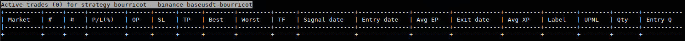

# Command Line Interface #

There is three sort of commands :
* On the terminal shell: command line arguments,
* During the program terminal instance :
  * Default mode,
  * Command mode.

## Command Line Arguments ##

To start SiiS bot, you must from the command line interpreter (bash, sh, command.exe...),
type the command line.

```
python siis.py <identity> [--help, --options...]
```

* python is the interpreter that will execute the program
* siis.py is the main program entry point
* \<identity\> must be replaced by the name of a configured identity
* Some options must be defined depending on your goal

[Those options are explained into the general README.md.](../README.md)

## Program terminal instance ##

Once started you could exit the bot using the command **:quit** followed by the ENTER key.

There is a default mode, with some keys that are bound to some functions like changing the view,
table ordering or grouping, formatting and navigation :
* Upper case letters (capitals) are used to change the active view
  * A for account detail view (total asset value, margin, margin level...)
  * B for active alerts view
  * C to clear the content of the debug or console views
  * D for debug log view
  * F for actives and pending trades view
  * I for console log view
  * M for market details view
  * N for signal view
  * O for order view
  * P for performance view
  * Q for asset details view (free, locked, total quantity, average entry price...)
  * R for actives regions view
  * S for history trades view
  * T for market ticker view (bid, ask, mid, spread), 24h volume, last traded price...)
  * W for triggered alerts view
  * X for actives positions view
  * Z for strategy-traders stats per market view
* Navigation keys (h,j,k,l), arrows, page-up, page-down, home, end, plus(+), minus(-)
* Formatting keys (comma(,), semicolon(;), ! and %)
* Alias keys : F1 to F12 
* Desktop notifier shortcut (a,n)
* colon(:) key to activate the command mode
* ENTER key to validate a typed command
* ESCape key to cancel a currently typed command

The command mode begin when you tip a colon ":" character. Press ESCape key to cancel.

### Default mode ###

In default mode, global functions are accessible through direct keys :
* Changing the active view
* Clearing the console or signal or debug view content
* Toggle on the desktop notifier (popup and audio alerts)
* Formatting options
* Navigation trough tables and markets
* Global state

### Command mode ###

More specifics functions are obtained using the command mode :
* Create, modify, close or cancel trades
* Getting information, modify some parameters
* Create, modify, remove some alerts
* Create, modify, remove some trading region
* Charting (deprecated)
* Setting, unsetting command aliases
* ...

### Views ###

There are different views, accessible using actions keys.
On a view you can use the page-up and page-down keys to scroll per page,
or using a Shift+(Arrow-key) (left and right scroll by 1 column, up and down by 1 row).

The Shift+Page-Up and Shift+Page-Down allow to change the displayed strategy appliance.

The h,j,k and l key in default modes acts like the Shift+(Arrow-key). Some SSH client does not
correctly map Shit+(Arrow-key), then it is a useful alternative.

There are multiples regions :


#### Content region ###

The 4 rows area at the bottom of the screen, upside of the notifier and the command line,
defined the content message view.

All important message goes here, like a disconnection, or a major error.

#### Right pane ####

Unused, but reserved for later usage, like to display the order book.
It is disabled for now.

#### Console view ####

This is the initially displayed view, accessible through the Shift+I shortcut.
All logged message goes to this view, you can scroll using shift+arrow and page-up/down keys.

By default, it always auto-scroll to the last message.

Errors, warning, message, results of an interactive command goes here.

You can clear its content using Shift+C shortcut.

#### Debug view ####

This is where the developer debug message goes, accessible through the Shift+D shortcut.
All logged message goes to this view, you can scroll using shift+arrow and page-up/down keys.

By default, it always auto-scroll to the last message.

This is a special view, normally only using on development stage of a strategy.

You can clear its content using Shift+C shortcut.

#### Signal view ####

This is where the generated strategies/appliances signals goes, accessible through the Shift+N shortcut.

* Generated signal or trade are caught by this view, the last 200 only are visible.
* Each signal has a hash color
* The order is from oldest to the most recent
* The comma key ',' allow grouping signal entry and exit


...

#### Markets view ####

This display the status and details of the markets, accessible through the Shift+M shortcut.


...

#### Tickers view ####

This display tickers of the markets, accessible through the Shift+T shortcut.


...

#### Account view ####

This display accounts details like balance, margins, unrealized P/L are visibles, accessible through the Shift+A shortcut.


...

#### Asset view ####

This display assets balances, free, locked, total, unrealized P/L are visibles, accessible through the Shift+Q shortcut.


...

#### Active trades view ####

This display current active, valid or pending trades for the current strategy, accessible through the Shift+F shortcut.

The current displayed strategy/appliance can be switched using the Shift+Page-Up/Page-Down shortcuts.



...

#### History trades view ####

This display history of realized trades for the current strategy, accessible through the Shift+S shortcut.

The current displayed strategy/appliance can be switched using the Shift+Page-Up/Page-Down shortcuts.


...

#### Performance view ####

This display sums of the different trades per market and the total for the current strategy, accessible through the Shift+P shortcut.

The current displayed strategy/appliance can be switched using the Shift+Page-Up/Page-Down shortcuts.


...

#### Order book view ####

Order book goes to the right pane.

To toggle the display of the order book use the Shift+B shortcut.

The current displayed strategy/appliance can be switched using the Shift+Page-Up/Page-Down shortcuts.
The current displayed market can be switched using the +/- shortcuts.

#### Strategy state view ####

Each strategy-trader have some states, the ideas is to allow any strategy to display some living data, helping the
creation of a strategy, or helping to understand the state of some signals and indicators.

The current displayed strategy-trader can be switched using the Shift+Page-Up/Page-Down shortcuts.
The current displayed market can be switched using the +/- shortcuts.

...
