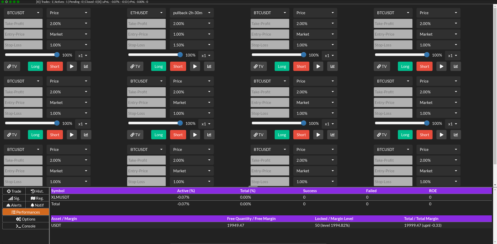
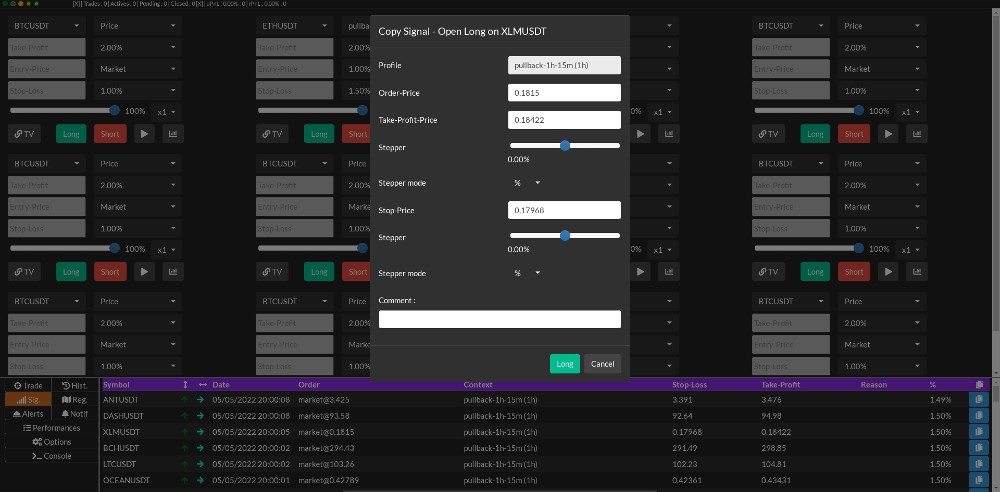
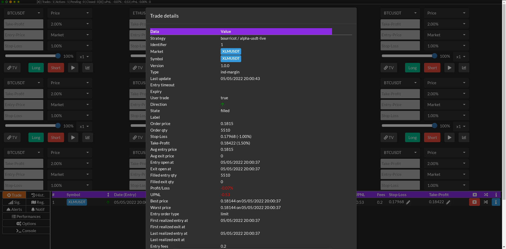
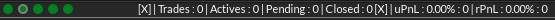
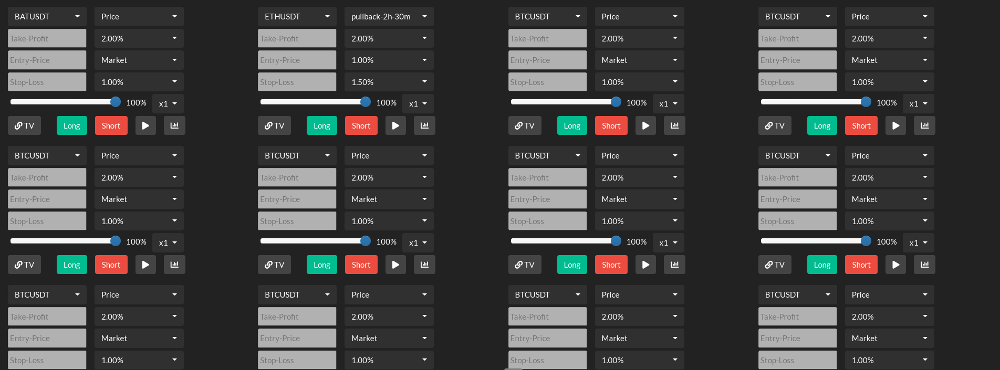
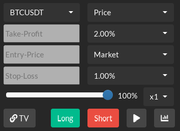
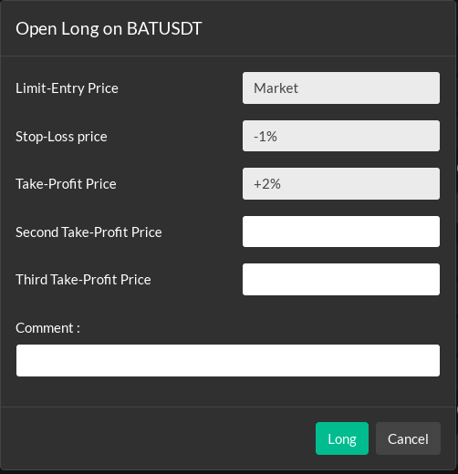
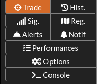
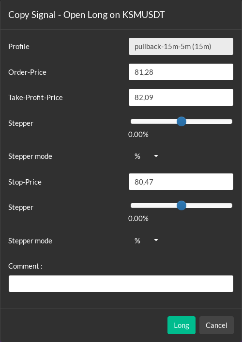

# Web Trader #


## Presentation ##

The Web Trader is a more user-friendly interface that is served by the bot instance.
Each instance can serve its own mini web-service, by setting the --monitor option on the CLI.

The monitoring port is configured by the monitoring.json file ([see configuration](../configuration/index.md)).
It can be overridden by the CLI option **--monitor-port=\<port\>**.

Example:

```bash
python siis.py real --profile=macd_usdt --monitor
```

or with override of port :

```bash
python siis.py real --profile=macd_usdt --monitor --monitor-port=6339
```

Now, you can open your favorite Web Browser with url :

```
http://127.0.0.1:6339
```

In the case of using bot locally. If you changed the default port or run multiple instance of SiiS you can change the port.
If you execute the bot on a server, you have to replace 127.0.0.1 by the IP of your server.

## Captures ##

### Performance ###



### Trade details ###



### Copy signal dialog ###



## Planned features ##

What are not implemented at this time ?

* Live charting
* Creation of alerts (price cross)
* Creation of regions (range and trend)
* Display list and details of configured regions
* Options :
  * Choosing audio alert theme
  * Light theme (and select from light and dark)
  * Browser desktop level notifications
* Strategy trader configuration and detailed view per market
* Changing some strategy trader options
* Display a risk:reward ratio
* Defining limit and stop by a max loss in percent of capital

## Permissions levels ##

There is multiple configurable permissions. Permissions can be removed to disable the trading capacity.

* **"strategy-view"**: Allow client to view strategy trader states, actives and pending trades, trade history, performance
* **"strategy-clean-trade"**: Allow client to clean an existing trade (remove without closing its related quantity)
* **"strategy-close-trade"**: Allow client to close an existing trade
* **"strategy-modify-trade"**: Allow client to modify an existing trade (stop-loss, take-profit, operations, comment ...)
* **"strategy-open-trade"**: Allow client to create a new trade
* **"strategy-trader"**: Allow client to modify option of strategy traders
* **"strategy-chart"**: Allow client to display chart with trades and performance
* **"trader-balance-view"**: Allow client to view assets quantity and margin balance
* **"trader-order-position-view"**: Allow client to view orders and positions
* **"trader-cancel-order"**: Allow client to cancel an order
* **"trader-close-position"**: Allow client to close a position

Allowed permissions are configured into the monitoring.json file.

## Top-bar ##



The top bar display the status of connectors, the counts of trades and the performance.
Move the mouse to one of the circle to know the related service.

If the circle is red there is a freeze of the service, if it is orange there is a lag, or it is ok during startup.

To hide the trade counts click the first [X].
* Trades: Number of total active or pending trades,
* Actives: Number of active trades,
* Pending: Number of pending (waiting to be open) trades,
* Closed: Number of closed trades (not those who was canceled).

To hide the performance details click the second [X].
* uPnL: Unrealized Profit and Loss,
* rPnl: Realized Profit and Loss.

## Trading panel ##



Below the top-bar, the main part, if the trading capacity are allowed there is multiple trading blocks.
Each block is distinct and can be attached to a market and a context.



From top to bottom and from left to right :
* Selection of the market
* Context
* Take-profit manual price
* Take-profit mode (percent from entry price, pip, manual price, none)
* Entry manual price
* Entry mode (market price, best maker price, percent from last price, pip from last price)
* Stop-loss manual price 
* Stop-loss mode (percent from entry price, pip, manual price, none)
* Quantity amount, in percent from the configured quantity (1% to 100%)
* Quantity factor (x1 to x10) then if amount is 100% and factor is x10 it means 1000% of configured quantity
* TV: Trading View (c) link to chart
* Long: Create a long order, CTRL+click direct order, simple click open a confirm dialog
* Short: Create a short order, CTRL+click direct order, simple click open a confirm dialog
* Play/Pause Toggle: Enable disable the automated trading for the market
* Charting: Open a tab with the market data, positions and orders

### Long/Short ordering and confirmation dialog ###



Clicking a Long or Short button a trader show a creation dialog. It serves as confirmation dialog,
and offers some advanced options.

This dialog is not displayed when clicking with the Ctrl key pressed and the trade is directly created.

## Menu ##



1) Active and pending trade : Trade
2) Historical trades : Hist.
3) Signals : Sig.
4) Trading regions : Reg.
5) Configured alerts : Alerts
6) Notified alerts : Notif
7) Performances details : Performances
8) Options, settings : Options
9) Console, list of logged events : Console

## Bottom panel ##

Its content depends on the selected menu.

### Active and pending trade : Trade ###

Any actives and opened trades (positions) are visible into this list. One row per trade.
If the trading capacities are allowed there is some buttons to :
* Modify take-profit
* Modify stop-loss (and adding step stop-loss)
* Set the stop-loss price at breakeven
* Closing trading at market
* Show a detailed dialog of the state of a trade

### Historical trades : Hist. ###

Any closed trades appears into this list. One row per trade.
There is a button to show a detailed dialog of the state of a trade.

### Signals : Sig. ###

Each signal generated by the bot are visible into this view. There is a copy button.
Clicking on the button for signal show a signal copy dialog.

This dialog is not displayed when clicking with the Ctrl key pressed and the trade is directly created.

### Signals copy and confirmation dialog ###



When a signal is copied through the confirmation dialog you can adjust some prices.

* Profile: Name of the context of trading related to how the signal is detected and how it must be managed
* Order-price: Entry limit price
* Take-profit price: Take-profit price given by the signal
* Stepper: Use the stepper to adjust from -5% to +5% to given signal take-profit price (or in pips)
* Stepper mode: Change the mode of the previous stepper from percent to pip
* Stop price: Stop loss (or in profit) price given by the signal
* Stepper: Use the stepper to adjust from -5% to +5% to given signal stop-price (or in pips)
* Stepper mode: Change the mode of the previous stepper from percent to pip
* Comment: Defines an optional user comment

## Trading regions : Reg.

Any configured and actives trading regions are listed into this view list.

...

### Configured alerts : Alerts ###

Any configured and actives alerts are listed into this view list.
There is a cancel button to delete the alert. 

...

### Notified alerts : Notif ###

Each time an alert is triggered a notification is inserted at the top of the view list.

...

### Performances details : Performances ###

Depending on the used account type (margin or spot) it will display per market and global performance.
Free margin, used margin and margin level are also displayed on margin account (CFD, Futures).

For each market there is respectively :
* Active (%): Active trades, unrealized profit and loss (in percent)
* Total (%): Closed trades, realized profit and loss (in percent) 
* Success: Total count of succeed trades
* Failed: Total count of failed trades
* ROE: Total count of trades returned at equity (no loss no gain)

For each owned asset the free, locked and total quantity are displayed.

...

### Options, settings : Options ###

For now there no settings, but it will allow configuring sound profile, notifications and more.

### Console, list of logged events : Console ###

Many logged messages are stored into the console log. Those messages are displayed for advanced usage and debugging.

## Security ##

You can allow or deny a list of IP address.
It is served in non-secure HTTP, and WS. If you want HTTPS and WSS you will have to configure a proxy server.

You can define the HTTP and WS server to allow at public IP address of the server,
or to localhost only. In the second case you limit the access to your machine, 
you can add a proxy server like Nginx to control your security and to add an HTTPS access.

Permission can be configured to have a read-only Web Trader. In that case the trading panel will not be displayed.
There is no possibility to configure different roles.
