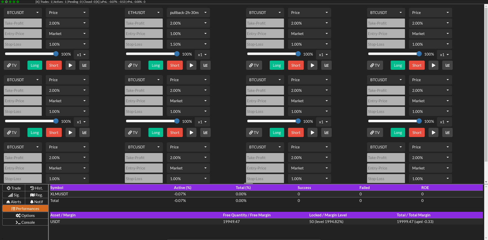
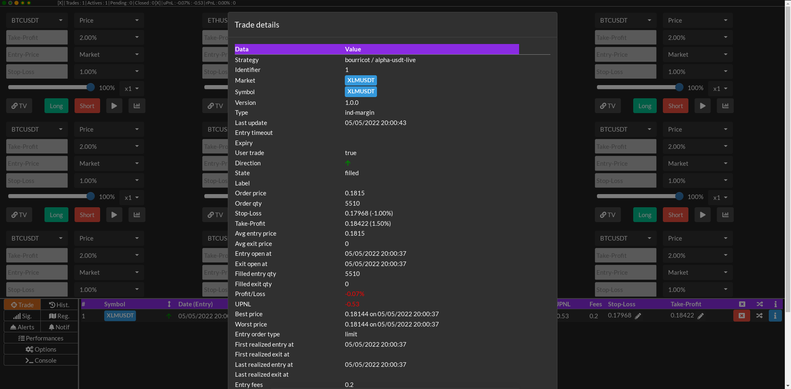

# Web Trader #


## Presentation ##

The Web Trader is a more user-friendly interface that is served by the bot instance.
Each instance can serve its own mini web-service, by setting the --monitor option on the CLI.

The monitoring port is configured by the monitoring.json file ([see configuration](../config.md)).
It can be overridden by the CLI option **--monitor-port=\<port\>**.

Example:

```bash
python siis.py real --profile=macd_usdt --monitor
```

or with override of port :

```bash
python siis.py real --profile=macd_usdt --monitor --monitor-port=6339
```

## Sample of captures ##

### Performance ###



### Trade details ###


### Copy signal dialog ###



## What is not implemented at this time ? ##

* Charting
* Creation of alerts
* Creation of regions
* Display of configured regions
* Options :
  * Choosing audio alert theme
  * Light theme (and select from light and dark)
  * Browser desktop level notifications
* Strategy trader configuration and detailed view per market
* Changing some strategy trader options
* Display a risk:reward ratio
* Defining limit and stop by a max loss in percent of capital

## Permissions levels ##

There is multiple configurable permissions. Permissions can be removed to disable the trading capacity.

* **"strategy-view"**: Allow client to view strategy trader states, actives and pending trades, trade history, performance
* **"strategy-clean-trade"**: Allow client to clean an existing trade (remove without closing its related quantity)
* **"strategy-close-trade"**: Allow client to close an existing trade
* **"strategy-modify-trade"**: Allow client to modify an existing trade (stop-loss, take-profit, operations, comment ...)
* **"strategy-open-trade"**: Allow client to create a new trade
* **"strategy-trader"**: Allow client to modify option of strategy traders
* **"strategy-chart"**: Allow client to display chart with trades and performance
* **"trader-balance-view"**: Allow client to view assets quantity and margin balance
* **"trader-order-position-view"**: Allow client to view orders and positions
* **"trader-cancel-order"**: Allow client to cancel an order
* **"trader-close-position"**: Allow client to close a position

Allowed permissions are configured into the monitoring.json file.

## Top bar ##

...

## Trading panel ##

...

## Menu ##

1) Active and pending trade : Trade
2) Historical trades : Hist.
3) Signals : Sig.
4) Trading regions : Reg.
5) Configured alerts : Alerts
6) Notified alerts : Notif
7) Performances details : Performances
8) Options, settings : Options
9) Console, list of logged events : Console

## Bottom panel ##

Its content depends on the selected menu.

### Active and pending trade : Trade ###

...

### Historical trades : Hist. ###

...

### Signals : Sig. ###

...

### Trading regions : Reg. ###

...

### Configured alerts : Alerts ###

...

### Notified alerts : Notif ###

...

### Performances details : Performances ###

...

### Options, settings : Options ###

...

### Console, list of logged events : Console ###

...

## Security ##

You can allow or deny a list of IP address.
It is served in non-secure HTTP, and WS. If you want HTTPS and WSS you will have to configure a proxy server.

You can define the HTTP and WS server to allow at public IP address of the server,
or to localhost only. In the second case you limit the access to your machine, 
you can add a proxy server like Nginx to control your security and to add an HTTPS access.

Permission can be configured to have a read-only Web Trader. In that case the trading panel will not be displayed.
There is no possibility to configure different roles.
